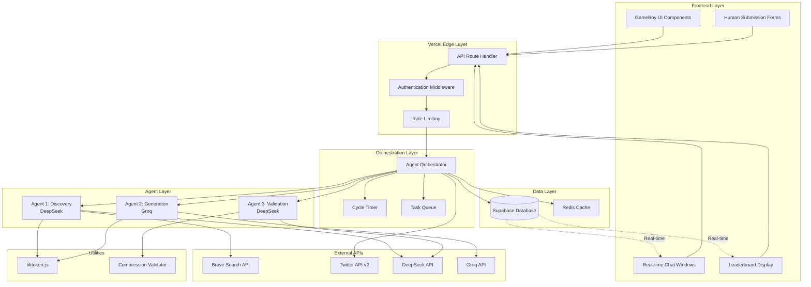

# Token Compressor Design Document

## Executive Summary

### Feature Overview
The Token Compressor is an AI agent discovery laboratory that orchestrates three specialized AI agents (DeepSeek and Groq) to collaborate in discovering text compression patterns that reduce AI API costs. The system operates through continuous 30-second discovery cycles for 55 minutes, followed by a 5-minute testing ceremony each hour, creating a competitive environment between AI agents and human participants.

### Key Architectural Decisions
1. **Multi-Agent Sequential Orchestration**: Implements a sequential pipeline pattern where Agent 1 discovers token waste patterns, Agent 2 generates compressions, and Agent 3 validates results
2. **Vercel Fluid Compute Architecture**: Leverages Vercel's 2024 serverless functions with optimized concurrency for cost-effective API route execution
3. **Security-First API Design**: All external API calls routed through secure Vercel backend routes, hiding credentials from frontend
4. **Event-Driven State Management**: Real-time UI updates through Supabase subscriptions and JavaScript event system
5. **Modular Component Architecture**: Refactoring monolithic HTML into maintainable components with clear separation of concerns

### Business Value
- **Cost Reduction**: Systematic discovery of token compression techniques to reduce AI API costs by 10-70%
- **Research Innovation**: First-of-its-kind competitive laboratory for AI-driven text compression research
- **Community Engagement**: Human participation system creates engagement and crowdsourced validation
- **Scalable Architecture**: Modern serverless design supports growth from prototype to production scale

### Implementation Timeline
- **Phase 1 (Weeks 1-2)**: Core architecture refactoring and Vercel API routes
- **Phase 2 (Weeks 3-4)**: Multi-agent system and orchestration implementation
- **Phase 3 (Weeks 5-6)**: Frontend modernization and real-time features
- **Phase 4 (Week 7)**: Integration testing, security hardening, and production deployment

## System Architecture

### High-Level System Design



### Component Interactions and Data Flow

**Discovery Cycle Flow:**
1. **Cycle Initialization**: Orchestrator starts 30-second timer and initializes agent queue
2. **Pattern Discovery**: Agent 1 searches Brave API for token waste patterns, processes results through tiktoken
3. **Compression Generation**: Agent 2 receives patterns, generates creative compressions using Groq API
4. **Validation**: Agent 3 validates reversibility and accuracy using test corpus
5. **Storage**: Validated compressions stored in Supabase with real-time UI updates
6. **Cycle Completion**: Process repeats for 55 minutes until testing ceremony

**Testing Ceremony Flow:**
1. **Pause Discovery**: All agent cycles pause at minute 55
2. **Re-validation**: Agent 3 re-tests all queued compressions with expanded corpus
3. **Codex Update**: Verified compressions added to permanent database
4. **Social Sharing**: Twitter bot tweets best discoveries of the hour
5. **Cycle Reset**: Discovery resumes automatically

**Human Participation Flow:**
1. **Submission**: Users submit original text and compression via secure form
2. **Validation**: Backend validates reversibility using same algorithms as Agent 3
3. **Leaderboard**: Successful submissions added to competitive leaderboard
4. **Integration**: Human discoveries compete with AI discoveries in unified system

## Agent Architecture

### Agent Orchestration Design

The system implements a **Sequential Orchestration Pattern** optimized for token compression discovery. This pattern ensures systematic processing while maintaining agent specialization and clear handoff points.

#### Core Orchestrator (`/api/orchestrator`)

```javascript
class AgentOrchestrator {
  constructor() {
    this.state = 'discovery'; // 'discovery' | 'ceremony' | 'paused'
    this.cycleCount = 0;
    this.queuedCompressions = [];
    this.agents = {
      discovery: new DiscoveryAgent(),
      generation: new GenerationAgent(), 
      validation: new ValidationAgent()
    };
  }
  
  async startDiscoveryCycle() {
    const cycle = {
      id: generateCycleId(),
      startTime: Date.now(),
      timeout: 30000,
      maxTurns: 10
    };
    
    try {
      // Step 1: Pattern Discovery
      const patterns = await this.agents.discovery.findPatterns(cycle);
      
      // Step 2: Compression Generation
      const compressions = await this.agents.generation.generateCompressions(patterns, cycle);
      
      // Step 3: Validation
      const validated = await this.agents.validation.validateCompressions(compressions, cycle);
      
      // Step 4: Queue for ceremony
      this.queuedCompressions.push(...validated);
      
      // Step 5: Real-time UI update
      await this.broadcastCycleResults(cycle, validated);
      
    } catch (error) {
      await this.handleCycleError(error, cycle);
    }
  }
}
```

### Agent 1: Discovery Agent (DeepSeek)

**Role**: Web search and token waste pattern detection  
**Specialization**: Research and analysis of existing text for inefficient token usage

```javascript
class DiscoveryAgent {
  constructor() {
    this.model = 'deepseek-chat';
    this.tools = ['brave_search', 'tiktoken_counter', 'pattern_analyzer'];
    this.searchCategories = ['technical_docs', 'research_papers', 'news_articles', 'social_media'];
  }
  
  async findPatterns(cycle) {
    const searchQuery = await this.generateSearchQuery();
    const searchResults = await this.callBraveSearch(searchQuery);
    const tokenAnalysis = await this.analyzeTokenUsage(searchResults);
    
    return {
      wastePatterns: tokenAnalysis.inefficientPhrases,
      frequency: tokenAnalysis.usage_counts,
      context: tokenAnalysis.contextual_usage,
      potential: this.calculateCompressionPotential(tokenAnalysis)
    };
  }
  
  async generateSearchQuery() {
    // Use DeepSeek's reasoning to identify high-value search terms
    // Focus on domains with repetitive, compressible language
    return this.prompt(`
      Generate a web search query to find text with high token compression potential.
      Focus on: technical documentation, academic papers, business communications.
      Previous successful patterns: ${this.getRecentSuccesses()}
      Current cycle: ${cycle.id}
    `);
  }
}
```

### Agent 2: Generation Agent (Groq)

**Role**: Creative compression technique invention  
**Specialization**: Fast inference for creative pattern generation and compression proposals

```javascript
class GenerationAgent {
  constructor() {
    this.model = 'llama-3.1-70b-versatile';
    this.tools = ['tiktoken_counter', 'compression_validator', 'creativity_booster'];
    this.compressionStrategies = ['abbreviation', 'symbolization', 'contextual_replacement', 'semantic_compression'];
  }
  
  async generateCompressions(patterns, cycle) {
    const compressions = [];
    
    for (const pattern of patterns.wastePatterns) {
      const techniques = await this.exploreCompressionTechniques(pattern);
      const proposals = await this.generateProposals(pattern, techniques);
      
      compressions.push(...proposals);
    }
    
    return this.rankProposals(compressions);
  }
  
  async exploreCompressionTechniques(pattern) {
    return this.prompt(`
      <analysis>
      Pattern: "${pattern.text}"
      Frequency: ${pattern.frequency}
      Token Count: ${pattern.tokenCount}
      Context: ${pattern.context}
      </analysis>
      
      <task>
      Generate 3-5 creative compression techniques for this pattern.
      Consider: abbreviations, symbols, contextual shortcuts, semantic compression.
      Ensure reversibility and maintain meaning.
      Optimize for maximum token reduction.
      </task>
      
      <format>
      Return JSON array of compression proposals with rationale.
      </format>
    `);
  }
}
```

### Agent 3: Validation Agent (DeepSeek)

**Role**: Compression testing and accuracy verification  
**Specialization**: Systematic validation of reversibility and semantic preservation

```javascript
class ValidationAgent {
  constructor() {
    this.model = 'deepseek-chat';
    this.tools = ['compression_tester', 'semantic_analyzer', 'reversibility_checker'];
    this.testCorpus = []; // Dynamically loaded test texts
  }
  
  async validateCompressions(compressions, cycle) {
    const validated = [];
    
    for (const compression of compressions) {
      const results = await this.runValidationSuite(compression);
      
      if (results.passed) {
        validated.push({
          ...compression,
          validation: results,
          score: this.calculateEfficiencyScore(compression, results)
        });
      }
    }
    
    return this.rankByEfficiency(validated);
  }
  
  async runValidationSuite(compression) {
    return {
      reversibility: await this.testReversibility(compression),
      semanticPreservation: await this.testSemanticPreservation(compression),
      contextualAccuracy: await this.testContextualAccuracy(compression),
      tokenSavings: await this.calculateTokenSavings(compression),
      riskAssessment: await this.assessRisks(compression)
    };
  }
}
```

### Agent Communication Protocol

Agents communicate through structured XML messages that ensure clear handoffs and maintain conversation limits:

```xml
<agent_communication>
  <cycle_id>{cycle_id}</cycle_id>
  <turn>{turn_number}/10</turn>
  <from>discovery_agent</from>
  <to>generation_agent</to>
  <payload>
    <patterns>
      <pattern>
        <text>approximately</text>
        <frequency>1250</frequency>
        <token_count>4</token_count>
        <contexts>["technical_docs", "academic_papers"]</contexts>
      </pattern>
    </patterns>
    <analysis>
      High compression potential due to frequent usage in formal contexts.
      Current token efficiency: 4 tokens for 13 characters (3.25 char/token).
      Compression opportunity: 75% reduction possible with symbolic replacement.
    </analysis>
  </payload>
</agent_communication>
```

## API Design

### Vercel API Route Architecture

The system leverages Vercel's Fluid Compute model for optimized serverless function execution with shared concurrency and efficient resource utilization.

#### Core API Routes Structure

```
/api/
├── agents/
│   ├── discovery/
│   │   ├── search.js          # Brave Search integration
│   │   ├── analyze.js         # Pattern analysis
│   │   └── tokens.js          # Token counting
│   ├── generation/
│   │   ├── compress.js        # Compression generation
│   │   ├── validate.js        # Quick validation
│   │   └── rank.js           # Proposal ranking
│   └── validation/
│       ├── test.js           # Comprehensive testing
│       ├── semantic.js       # Semantic analysis
│       └── score.js          # Efficiency scoring
├── orchestration/
│   ├── cycle.js              # Cycle management
│   ├── ceremony.js           # Testing ceremony
│   └── status.js            # System status
├── data/
│   ├── compressions.js       # CRUD operations
│   ├── leaderboard.js        # Rankings and stats
│   └── submissions.js        # Human submissions
├── external/
│   ├── brave.js             # Brave Search proxy
│   ├── twitter.js           # Twitter bot API
│   └── tiktoken.js          # Token counting service
└── auth/
    ├── validate.js          # API key validation
    └── ratelimit.js         # Rate limiting
```

#### API Route Implementation Patterns

**1. Agent Service Routes** (`/api/agents/{service}/{action}`)

```javascript
// /api/agents/discovery/search.js
export default async function handler(req, res) {
  try {
    // Input validation
    const { query, category, cycleId } = req.body;
    if (!query || !cycleId) {
      return res.status(400).json({ error: 'Missing required parameters' });
    }
    
    // Rate limiting check
    const rateLimit = await checkRateLimit(req.ip, 'brave_search');
    if (!rateLimit.allowed) {
      return res.status(429).json({ error: 'Rate limit exceeded', retryAfter: rateLimit.resetTime });
    }
    
    // Secure API call
    const searchResults = await braveSearch({
      query: sanitizeQuery(query),
      category: category || 'general',
      safeSearch: true,
      count: 10
    });
    
    // Process and validate results
    const processedResults = await processSearchResults(searchResults, cycleId);
    
    // Log for monitoring
    await logAPICall('brave_search', { query, results: processedResults.length, cycleId });
    
    res.status(200).json({
      success: true,
      results: processedResults,
      metadata: {
        query,
        timestamp: new Date().toISOString(),
        processingTime: performance.now() - startTime
      }
    });
    
  } catch (error) {
    await logError('brave_search_error', error, { cycleId, query });
    res.status(500).json({ 
      error: 'Search service unavailable', 
      retryAfter: 60 
    });
  }
}
```

**2. Orchestration Routes** (`/api/orchestration/{action}`)

```javascript
// /api/orchestration/cycle.js
export default async function handler(req, res) {
  const { method } = req;
  
  switch (method) {
    case 'POST': // Start new cycle
      return startDiscoveryCycle(req, res);
    case 'GET': // Get cycle status
      return getCycleStatus(req, res);
    case 'PUT': // Update cycle state
      return updateCycleState(req, res);
    default:
      return res.status(405).json({ error: 'Method not allowed' });
  }
}

async function startDiscoveryCycle(req, res) {
  try {
    // Check system state
    const systemState = await getSystemState();
    if (systemState.state !== 'ready') {
      return res.status(409).json({ 
        error: 'System not ready for new cycle',
        currentState: systemState.state 
      });
    }
    
    // Initialize cycle
    const cycle = await initializeCycle({
      startTime: Date.now(),
      timeout: 30000,
      maxTurns: 10,
      agents: ['discovery', 'generation', 'validation']
    });
    
    // Start agent orchestration (background task)
    orchestrateCycle(cycle).catch(handleCycleError);
    
    res.status(202).json({
      success: true,
      cycle: {
        id: cycle.id,
        status: 'started',
        estimatedCompletion: Date.now() + 30000
      }
    });
    
  } catch (error) {
    await logError('cycle_start_error', error);
    res.status(500).json({ error: 'Failed to start cycle' });
  }
}
```

**3. External API Proxy Routes** (`/api/external/{service}`)

```javascript
// /api/external/brave.js
export default async function handler(req, res) {
  // Verify internal API call
  if (!verifyInternalRequest(req)) {
    return res.status(401).json({ error: 'Unauthorized' });
  }
  
  try {
    const { query, options = {} } = req.body;
    
    const braveResponse = await fetch('https://api.search.brave.com/res/v1/web/search', {
      method: 'POST',
      headers: {
        'Authorization': `Bearer ${process.env.BRAVE_API_KEY}`,
        'Content-Type': 'application/json',
        'X-Subscription-Token': process.env.BRAVE_SUBSCRIPTION_TOKEN
      },
      body: JSON.stringify({
        q: query,
        count: options.count || 10,
        safe_search: 'strict',
        ...options
      })
    });
    
    if (!braveResponse.ok) {
      throw new Error(`Brave API error: ${braveResponse.status}`);
    }
    
    const data = await braveResponse.json();
    
    // Filter and sanitize results
    const filteredResults = data.web?.results?.map(result => ({
      title: sanitizeText(result.title),
      snippet: sanitizeText(result.description),
      url: result.url,
      publishedDate: result.published
    })) || [];
    
    res.status(200).json({
      success: true,
      results: filteredResults,
      total: filteredResults.length
    });
    
  } catch (error) {
    await logError('brave_api_error', error);
    res.status(502).json({ error: 'Search service unavailable' });
  }
}
```

### Request/Response Schemas

#### Agent Communication Schema

```typescript
interface AgentRequest {
  cycleId: string;
  agentType: 'discovery' | 'generation' | 'validation';
  action: string;
  payload: any;
  metadata: {
    turnCount: number;
    timeRemaining: number;
    priority: 'low' | 'medium' | 'high';
  };
}

interface AgentResponse {
  success: boolean;
  agentId: string;
  cycleId: string;
  results: any;
  nextAgent?: string;
  processingTime: number;
  error?: {
    code: string;
    message: string;
    retryable: boolean;
  };
}
```

#### Compression Data Schema

```typescript
interface CompressionProposal {
  id: string;
  original: string;
  compressed: string;
  source: 'AI' | `Human: ${string}`;
  tokenSavings: number;
  efficiency: number; // percentage
  validation: {
    reversible: boolean;
    semanticPreservation: number; // 0-1 score
    contextualAccuracy: number; // 0-1 score
    riskLevel: 'low' | 'medium' | 'high';
  };
  metadata: {
    discoveredBy: string;
    cycleId: string;
    timestamp: string;
    testCorpusSize: number;
  };
}
```

## Database Design

### Enhanced Schema Design

Building upon the existing Supabase schema, the system requires additional tables and optimizations for multi-agent orchestration and real-time features.

#### New Tables for Agent Operations

```sql
-- Agent cycles tracking table
CREATE TABLE agent_cycles (
  id SERIAL PRIMARY KEY,
  cycle_id UUID UNIQUE NOT NULL DEFAULT uuid_generate_v4(),
  state TEXT NOT NULL CHECK (state IN ('initializing', 'discovery', 'generation', 'validation', 'completed', 'failed')),
  started_at TIMESTAMP WITH TIME ZONE DEFAULT NOW(),
  completed_at TIMESTAMP WITH TIME ZONE,
  total_turns INTEGER DEFAULT 0,
  patterns_found INTEGER DEFAULT 0,
  compressions_generated INTEGER DEFAULT 0,
  compressions_validated INTEGER DEFAULT 0,
  error_message TEXT,
  
  -- Performance tracking
  processing_time_ms INTEGER,
  token_usage INTEGER DEFAULT 0,
  api_calls_count INTEGER DEFAULT 0,
  
  -- Indexing for queries
  INDEX idx_cycles_state (state),
  INDEX idx_cycles_started (started_at DESC)
);

-- Agent conversations and communications
CREATE TABLE agent_conversations (
  id SERIAL PRIMARY KEY,
  cycle_id UUID NOT NULL REFERENCES agent_cycles(cycle_id) ON DELETE CASCADE,
  turn_number INTEGER NOT NULL,
  from_agent TEXT NOT NULL CHECK (from_agent IN ('discovery', 'generation', 'validation', 'orchestrator')),
  to_agent TEXT NOT NULL CHECK (to_agent IN ('discovery', 'generation', 'validation', 'orchestrator', 'ui')),
  message_type TEXT NOT NULL CHECK (message_type IN ('task', 'result', 'error', 'status')),
  content JSONB NOT NULL,
  timestamp TIMESTAMP WITH TIME ZONE DEFAULT NOW(),
  
  -- Ensure conversation ordering
  UNIQUE(cycle_id, turn_number, from_agent),
  INDEX idx_conversations_cycle (cycle_id, turn_number),
  INDEX idx_conversations_timestamp (timestamp DESC)
);

-- Pattern discovery tracking
CREATE TABLE discovered_patterns (
  id SERIAL PRIMARY KEY,
  cycle_id UUID NOT NULL REFERENCES agent_cycles(cycle_id) ON DELETE CASCADE,
  pattern_text TEXT NOT NULL,
  frequency INTEGER DEFAULT 1,
  token_count INTEGER NOT NULL,
  compression_potential DECIMAL(5,2), -- Expected efficiency percentage
  contexts TEXT[], -- Array of context types
  source_urls TEXT[], -- URLs where pattern was found
  discovered_at TIMESTAMP WITH TIME ZONE DEFAULT NOW(),
  
  -- Prevent duplicate patterns per cycle
  UNIQUE(cycle_id, pattern_text),
  INDEX idx_patterns_frequency (frequency DESC),
  INDEX idx_patterns_potential (compression_potential DESC)
);

-- System state and configuration
CREATE TABLE system_state (
  id SERIAL PRIMARY KEY,
  key TEXT UNIQUE NOT NULL,
  value JSONB NOT NULL,
  updated_at TIMESTAMP WITH TIME ZONE DEFAULT NOW(),
  updated_by TEXT DEFAULT 'system'
);

-- Initialize system state
INSERT INTO system_state (key, value) VALUES
  ('current_mode', '"discovery"'), -- "discovery" | "ceremony" | "maintenance"
  ('cycle_config', '{
    "duration_seconds": 30,
    "max_turns": 10,
    "discovery_minutes": 55,
    "ceremony_minutes": 5
  }'),
  ('agent_config', '{
    "discovery": {"model": "deepseek-chat", "max_tokens": 1000},
    "generation": {"model": "llama-3.1-70b-versatile", "max_tokens": 800},
    "validation": {"model": "deepseek-chat", "max_tokens": 1200}
  }'),
  ('rate_limits', '{
    "brave_search": {"requests_per_hour": 100, "requests_per_minute": 10},
    "twitter_api": {"tweets_per_hour": 1, "requests_per_minute": 5},
    "agent_api": {"requests_per_minute": 60}
  }')
ON CONFLICT (key) DO UPDATE SET 
  value = EXCLUDED.value, 
  updated_at = NOW();
```

#### Enhanced Existing Tables

```sql
-- Add agent orchestration fields to compressions table
ALTER TABLE compressions 
ADD COLUMN cycle_id UUID REFERENCES agent_cycles(cycle_id),
ADD COLUMN validation_score DECIMAL(3,2) DEFAULT NULL, -- 0.00-1.00
ADD COLUMN risk_level TEXT DEFAULT 'low' CHECK (risk_level IN ('low', 'medium', 'high')),
ADD COLUMN test_corpus_size INTEGER DEFAULT 0,
ADD COLUMN semantic_preservation DECIMAL(3,2) DEFAULT NULL;

-- Add performance tracking to submissions
ALTER TABLE submissions
ADD COLUMN validation_time_ms INTEGER DEFAULT NULL,
ADD COLUMN token_savings_validated INTEGER DEFAULT NULL,
ADD COLUMN efficiency_percentage DECIMAL(5,2) DEFAULT NULL;

-- Enhance stats table for real-time monitoring
INSERT INTO stats (metric_name, metric_value) VALUES
  ('active_cycles', 0),
  ('successful_cycles_today', 0),
  ('failed_cycles_today', 0),
  ('avg_cycle_time_ms', 0),
  ('total_api_calls_today', 0),
  ('agent_discovery_success_rate', 0),
  ('agent_generation_success_rate', 0),
  ('agent_validation_success_rate', 0)
ON CONFLICT (metric_name) DO NOTHING;
```

### Data Access Patterns

#### Real-time Subscription Queries

```sql
-- Real-time agent conversation updates
SELECT 
  ac.cycle_id,
  ac.turn_number,
  ac.from_agent,
  ac.to_agent,
  ac.content,
  ac.timestamp
FROM agent_conversations ac
WHERE ac.timestamp > NOW() - INTERVAL '1 hour'
ORDER BY ac.timestamp DESC;

-- Live cycle status updates
SELECT 
  c.cycle_id,
  c.state,
  c.total_turns,
  c.patterns_found,
  c.compressions_generated,
  c.compressions_validated,
  c.started_at,
  EXTRACT(EPOCH FROM (NOW() - c.started_at)) as elapsed_seconds
FROM agent_cycles c
WHERE c.state NOT IN ('completed', 'failed')
ORDER BY c.started_at DESC;

-- Leaderboard with real-time updates
SELECT 
  l.name,
  l.compressions_count,
  l.tokens_saved,
  l.date,
  ROW_NUMBER() OVER (ORDER BY l.tokens_saved DESC) as rank
FROM leaderboard l
WHERE l.date = CURRENT_DATE
ORDER BY l.tokens_saved DESC
LIMIT 10;
```

#### Performance Optimization Queries

```sql
-- Efficient compression lookup with caching
CREATE MATERIALIZED VIEW compression_cache AS
SELECT 
  c.original,
  c.compressed,
  c.tokens_saved,
  c.frequency,
  c.validation_score,
  c.created_at
FROM compressions c
WHERE c.validation_score > 0.8
ORDER BY c.tokens_saved DESC;

-- Refresh cache periodically
CREATE INDEX idx_compression_cache_refresh ON compression_cache (created_at DESC);

-- Agent performance analytics
CREATE VIEW agent_performance AS
SELECT 
  DATE(c.started_at) as date,
  COUNT(*) as total_cycles,
  COUNT(*) FILTER (WHERE c.state = 'completed') as successful_cycles,
  AVG(c.processing_time_ms) as avg_processing_time,
  AVG(c.patterns_found) as avg_patterns_found,
  AVG(c.compressions_validated) as avg_compressions_validated
FROM agent_cycles c
WHERE c.started_at > NOW() - INTERVAL '30 days'
GROUP BY DATE(c.started_at)
ORDER BY date DESC;
```

## Frontend Architecture

### Modular Component Structure

The frontend will be refactored from the monolithic 1,528-line HTML file into a modular, maintainable architecture while preserving the GameBoy aesthetic.

```
src/
├── components/
│   ├── core/
│   │   ├── Header.js                # Main header with title and status
│   │   ├── StatsBar.js             # Real-time statistics display
│   │   └── Layout.js               # Main layout wrapper
│   ├── agents/
│   │   ├── ChatWindow.js           # Individual agent chat display
│   │   ├── AgentStatus.js          # Agent activity indicators
│   │   ├── CycleTimer.js           # 30-second cycle countdown
│   │   └── OrchestrationPanel.js   # Orchestrator controls
│   ├── discovery/
│   │   ├── CompressionCard.js      # Individual compression display
│   │   ├── PatternList.js          # Discovered patterns list
│   │   └── DiscoveryFeed.js        # Live discovery updates
│   ├── human/
│   │   ├── SubmissionForm.js       # Human compression submission
│   │   ├── ValidationResults.js    # Submission feedback
│   │   └── LeaderboardEntry.js     # Individual leaderboard row
│   ├── ceremony/
│   │   ├── TestingStatus.js        # Testing ceremony progress
│   │   ├── CodexUpdates.js         # New additions to codex
│   │   └── TwitterPreview.js       # Tweet preview/status
│   └── shared/
│       ├── GameBoyButton.js        # Styled buttons
│       ├── RetroPanel.js           # Panel containers
│       ├── LoadingSpinner.js       # GameBoy-style loading
│       └── ErrorBoundary.js        # Error handling wrapper
├── styles/
│   ├── gameboy.css                 # Core GameBoy aesthetic
│   ├── components.css              # Component-specific styles
│   ├── animations.css              # Retro animations
│   └── responsive.css              # Mobile adaptations
├── utils/
│   ├── api.js                      # API client functions
│   ├── websocket.js                # Real-time connection
│   ├── formatting.js               # Text formatting utilities
│   ├── validation.js               # Client-side validation
│   └── tiktoken-client.js          # Browser token counting
├── services/
│   ├── AgentService.js             # Agent communication
│   ├── CompressionService.js       # Compression operations
│   ├── LeaderboardService.js       # Rankings and stats
│   └── RealtimeService.js          # Supabase subscriptions
└── app.js                          # Main application entry point
```

#### Core Components Implementation

**1. Main Application Controller** (`app.js`)

```javascript
class TokenCompressorApp {
  constructor() {
    this.state = {
      systemMode: 'discovery', // 'discovery' | 'ceremony' | 'maintenance'
      activeCycle: null,
      agents: {
        discovery: { status: 'idle', lastActive: null },
        generation: { status: 'idle', lastActive: null },
        validation: { status: 'idle', lastActive: null }
      },
      stats: {},
      leaderboard: []
    };
    
    this.services = {
      api: new APIService(),
      realtime: new RealtimeService(),
      compression: new CompressionService(),
      leaderboard: new LeaderboardService()
    };
    
    this.components = {};
  }
  
  async initialize() {
    // Initialize services
    await this.services.realtime.connect();
    
    // Load initial data
    await this.loadInitialData();
    
    // Initialize components
    this.initializeComponents();
    
    // Setup real-time subscriptions
    this.setupRealtimeSubscriptions();
    
    // Start application loop
    this.startApplicationLoop();
  }
  
  initializeComponents() {
    // Initialize all components with state management
    this.components.header = new Header(this);
    this.components.statsBar = new StatsBar(this);
    this.components.agentChats = new AgentChatWindows(this);
    this.components.discoveryFeed = new DiscoveryFeed(this);
    this.components.leaderboard = new Leaderboard(this);
    this.components.submissionForm = new SubmissionForm(this);
    
    // Render initial state
    this.render();
  }
  
  async updateState(newState) {
    this.state = { ...this.state, ...newState };
    await this.render();
    
    // Notify components of state change
    Object.values(this.components).forEach(component => {
      if (component.onStateUpdate) {
        component.onStateUpdate(this.state);
      }
    });
  }
}
```

**2. Agent Chat Window Component** (`components/agents/ChatWindow.js`)

```javascript
class ChatWindow {
  constructor(agentType, app) {
    this.agentType = agentType;
    this.app = app;
    this.messages = [];
    this.maxMessages = 50; // Limit for performance
    this.element = null;
    
    this.render();
  }
  
  render() {
    this.element = document.createElement('div');
    this.element.className = `agent-window agent-${this.agentType}`;
    this.element.innerHTML = `
      <div class="agent-header">
        <span class="agent-name">${this.getAgentDisplayName()}</span>
        <span class="agent-status ${this.getStatusClass()}">${this.getStatusText()}</span>
      </div>
      <div class="chat-messages" id="messages-${this.agentType}">
        ${this.renderMessages()}
      </div>
      <div class="chat-input-area">
        <div class="turn-counter">Turn: ${this.getCurrentTurn()}/10</div>
        <div class="typing-indicator ${this.isTyping() ? 'active' : ''}">
          <span>●</span><span>●</span><span>●</span>
        </div>
      </div>
    `;
    
    return this.element;
  }
  
  addMessage(message) {
    this.messages.push({
      id: generateId(),
      ...message,
      timestamp: new Date().toISOString()
    });
    
    // Maintain message limit
    if (this.messages.length > this.maxMessages) {
      this.messages.shift();
    }
    
    this.updateMessages();
    this.scrollToBottom();
  }
  
  updateMessages() {
    const messagesContainer = this.element.querySelector('.chat-messages');
    messagesContainer.innerHTML = this.renderMessages();
  }
  
  renderMessages() {
    return this.messages.map(msg => `
      <div class="message message-${msg.type}" data-turn="${msg.turn}">
        <div class="message-header">
          <span class="message-from">${msg.from}</span>
          <span class="message-time">${formatTime(msg.timestamp)}</span>
        </div>
        <div class="message-content">${this.formatMessageContent(msg.content)}</div>
        ${msg.data ? this.renderMessageData(msg.data) : ''}
      </div>
    `).join('');
  }
  
  formatMessageContent(content) {
    // Apply GameBoy-style formatting
    return content
      .replace(/\*\*(.*?)\*\*/g, '<strong>$1</strong>')
      .replace(/`(.*?)`/g, '<code>$1</code>')
      .replace(/\n/g, '<br>');
  }
}
```

**3. Real-time Service** (`services/RealtimeService.js`)

```javascript
class RealtimeService {
  constructor(supabaseUrl, supabaseKey) {
    this.supabase = supabase.createClient(supabaseUrl, supabaseKey);
    this.subscriptions = new Map();
    this.reconnectAttempts = 0;
    this.maxReconnectAttempts = 5;
  }
  
  async connect() {
    try {
      // Subscribe to agent conversations
      this.subscriptions.set('conversations', 
        this.supabase
          .channel('agent_conversations')
          .on('postgres_changes', 
            { event: 'INSERT', schema: 'public', table: 'agent_conversations' },
            this.handleNewConversation.bind(this)
          )
          .subscribe()
      );
      
      // Subscribe to cycle updates
      this.subscriptions.set('cycles',
        this.supabase
          .channel('agent_cycles')
          .on('postgres_changes',
            { event: '*', schema: 'public', table: 'agent_cycles' },
            this.handleCycleUpdate.bind(this)
          )
          .subscribe()
      );
      
      // Subscribe to compression updates
      this.subscriptions.set('compressions',
        this.supabase
          .channel('compressions')
          .on('postgres_changes',
            { event: 'INSERT', schema: 'public', table: 'compressions' },
            this.handleNewCompression.bind(this)
          )
          .subscribe()
      );
      
      // Subscribe to leaderboard updates
      this.subscriptions.set('leaderboard',
        this.supabase
          .channel('leaderboard')
          .on('postgres_changes',
            { event: '*', schema: 'public', table: 'leaderboard' },
            this.handleLeaderboardUpdate.bind(this)
          )
          .subscribe()
      );
      
      this.reconnectAttempts = 0;
      console.log('Real-time connection established');
      
    } catch (error) {
      console.error('Failed to establish real-time connection:', error);
      await this.handleConnectionError(error);
    }
  }
  
  handleNewConversation(payload) {
    const message = payload.new;
    
    // Route to appropriate chat window
    const event = new CustomEvent('agent-message', {
      detail: {
        agentType: message.to_agent,
        message: {
          from: message.from_agent,
          content: message.content,
          type: message.message_type,
          turn: message.turn_number,
          cycleId: message.cycle_id
        }
      }
    });
    
    document.dispatchEvent(event);
  }
  
  handleCycleUpdate(payload) {
    const cycle = payload.new;
    
    // Update global state
    const event = new CustomEvent('cycle-update', {
      detail: { cycle }
    });
    
    document.dispatchEvent(event);
  }
  
  async handleConnectionError(error) {
    if (this.reconnectAttempts < this.maxReconnectAttempts) {
      this.reconnectAttempts++;
      const delay = Math.pow(2, this.reconnectAttempts) * 1000; // Exponential backoff
      
      console.log(`Reconnecting in ${delay}ms (attempt ${this.reconnectAttempts})`);
      
      setTimeout(() => {
        this.connect();
      }, delay);
    } else {
      console.error('Max reconnection attempts reached');
      
      // Fallback to polling
      this.startPollingMode();
    }
  }
}
```

### GameBoy Aesthetic Preservation

The modular refactoring maintains the distinctive GameBoy aesthetic through consistent styling patterns:

```css
/* gameboy.css - Core aesthetic styles */
:root {
  --gameboy-green-dark: #8b956d;
  --gameboy-green-medium: #9cA971;
  --gameboy-green-light: #c4cfa1;
  --gameboy-dark: #2e3020;
  --gameboy-accent: #4a5139;
  
  --gameboy-font: 'VT323', monospace;
  --gameboy-border: 4px solid var(--gameboy-dark);
  --gameboy-shadow: 6px 6px 0px var(--gameboy-dark);
  --gameboy-radius: 0px; /* Sharp corners for retro feel */
}

.retro-panel {
  background: var(--gameboy-green-light);
  border: var(--gameboy-border);
  box-shadow: var(--gameboy-shadow);
  font-family: var(--gameboy-font);
  font-size: 18px;
  padding: 15px;
  margin-bottom: 20px;
}

.gameboy-button {
  background: var(--gameboy-green-medium);
  border: 3px solid var(--gameboy-dark);
  color: var(--gameboy-dark);
  font-family: var(--gameboy-font);
  font-size: 16px;
  padding: 10px 20px;
  cursor: pointer;
  transition: all 0.1s ease;
}

.gameboy-button:hover {
  background: var(--gameboy-green-dark);
  transform: translate(2px, 2px);
  box-shadow: 2px 2px 0px var(--gameboy-dark);
}

.gameboy-button:active {
  transform: translate(4px, 4px);
  box-shadow: none;
}

/* Blinking animations */
@keyframes blink {
  0%, 100% { opacity: 1; }
  50% { opacity: 0.6; }
}

.status-active {
  animation: blink 1s infinite;
}

/* Typing indicator */
.typing-indicator span {
  animation: bounce 1.4s infinite ease-in-out;
  animation-fill-mode: both;
}

.typing-indicator span:nth-child(1) { animation-delay: -0.32s; }
.typing-indicator span:nth-child(2) { animation-delay: -0.16s; }

@keyframes bounce {
  0%, 80%, 100% {
    transform: scale(0);
  }
  40% {
    transform: scale(1);
  }
}
```

## Security Design

### API Key Management and Protection

The system implements a security-first approach with multiple layers of protection for sensitive credentials and data.

#### Environment Variable Management

```javascript
// /api/config/security.js
class SecurityManager {
  constructor() {
    this.requiredEnvVars = [
      'SUPABASE_URL',
      'SUPABASE_ANON_KEY',
      'SUPABASE_SERVICE_ROLE_KEY',
      'DEEPSEEK_API_KEY',
      'GROQ_API_KEY',
      'BRAVE_API_KEY',
      'BRAVE_SUBSCRIPTION_TOKEN',
      'TWITTER_API_KEY',
      'TWITTER_API_SECRET',
      'TWITTER_ACCESS_TOKEN',
      'TWITTER_ACCESS_TOKEN_SECRET',
      'JWT_SECRET',
      'ENCRYPTION_KEY'
    ];
    
    this.validateEnvironment();
  }
  
  validateEnvironment() {
    const missing = this.requiredEnvVars.filter(key => !process.env[key]);
    
    if (missing.length > 0) {
      throw new Error(`Missing required environment variables: ${missing.join(', ')}`);
    }
  }
  
  getAPIKey(service) {
    const keyMap = {
      'deepseek': process.env.DEEPSEEK_API_KEY,
      'groq': process.env.GROQ_API_KEY,
      'brave': process.env.BRAVE_API_KEY,
      'twitter': {
        apiKey: process.env.TWITTER_API_KEY,
        apiSecret: process.env.TWITTER_API_SECRET,
        accessToken: process.env.TWITTER_ACCESS_TOKEN,
        accessTokenSecret: process.env.TWITTER_ACCESS_TOKEN_SECRET
      }
    };
    
    return keyMap[service];
  }
}
```

#### Request Validation and Sanitization

```javascript
// /api/middleware/validation.js
export function validateRequest(req, res, next) {
  // Rate limiting by IP
  const rateLimitKey = `rate_limit_${req.ip}`;
  const currentCount = cache.get(rateLimitKey) || 0;
  
  if (currentCount > 100) { // 100 requests per hour per IP
    return res.status(429).json({
      error: 'Rate limit exceeded',
      retryAfter: 3600
    });
  }
  
  cache.set(rateLimitKey, currentCount + 1, 3600);
  
  // Input sanitization
  if (req.body) {
    req.body = sanitizeInput(req.body);
  }
  
  // CORS validation
  const allowedOrigins = [
    'https://token-compressor.vercel.app',
    'https://tokencompressor.ai',
    'http://localhost:3000' // Development only
  ];
  
  const origin = req.headers.origin;
  if (origin && !allowedOrigins.includes(origin)) {
    return res.status(403).json({ error: 'Forbidden origin' });
  }
  
  next();
}

function sanitizeInput(input) {
  if (typeof input === 'string') {
    return input
      .replace(/<script\b[^<]*(?:(?!<\/script>)<[^<]*)*<\/script>/gi, '') // Remove scripts
      .replace(/javascript:/gi, '') // Remove javascript: URLs
      .replace(/on\w+\s*=/gi, '') // Remove event handlers
      .trim();
  }
  
  if (typeof input === 'object' && input !== null) {
    const sanitized = {};
    for (const key in input) {
      sanitized[key] = sanitizeInput(input[key]);
    }
    return sanitized;
  }
  
  return input;
}
```

#### Internal API Authentication

```javascript
// /api/middleware/auth.js
export function verifyInternalRequest(req) {
  // Check for internal service token
  const internalToken = req.headers['x-internal-token'];
  if (!internalToken) {
    return false;
  }
  
  // Verify token signature
  try {
    const payload = jwt.verify(internalToken, process.env.JWT_SECRET);
    return payload.service === 'token-compressor-internal';
  } catch (error) {
    return false;
  }
}

export function generateInternalToken() {
  return jwt.sign(
    { service: 'token-compressor-internal' },
    process.env.JWT_SECRET,
    { expiresIn: '1h' }
  );
}

// Usage in frontend API client
class APIClient {
  constructor() {
    this.baseURL = '/api';
    this.internalToken = null;
  }
  
  async getInternalToken() {
    if (!this.internalToken) {
      const response = await fetch(`${this.baseURL}/auth/token`, {
        method: 'POST',
        headers: { 'Content-Type': 'application/json' },
        body: JSON.stringify({ purpose: 'internal-api' })
      });
      
      if (!response.ok) {
        throw new Error('Failed to obtain internal token');
      }
      
      const data = await response.json();
      this.internalToken = data.token;
    }
    
    return this.internalToken;
  }
  
  async makeInternalAPICall(endpoint, options = {}) {
    const token = await this.getInternalToken();
    
    return fetch(`${this.baseURL}${endpoint}`, {
      ...options,
      headers: {
        'Content-Type': 'application/json',
        'X-Internal-Token': token,
        ...options.headers
      }
    });
  }
}
```

### Data Privacy and PII Protection

```javascript
// /api/utils/privacy.js
class PrivacyProtector {
  constructor() {
    this.piiPatterns = [
      /\b[A-Za-z0-9._%+-]+@[A-Za-z0-9.-]+\.[A-Z|a-z]{2,}\b/g, // Email
      /\b\d{3}-\d{2}-\d{4}\b/g, // SSN
      /\b\d{4}[\s-]?\d{4}[\s-]?\d{4}[\s-]?\d{4}\b/g, // Credit card
      /\b\d{3}[\s.-]?\d{3}[\s.-]?\d{4}\b/g, // Phone number
      /\b\d{1,3}\.\d{1,3}\.\d{1,3}\.\d{1,3}\b/g // IP address
    ];
  }
  
  detectPII(text) {
    const detected = [];
    
    this.piiPatterns.forEach((pattern, index) => {
      const matches = text.match(pattern);
      if (matches) {
        detected.push({
          type: this.getPIIType(index),
          matches: matches,
          count: matches.length
        });
      }
    });
    
    return detected;
  }
  
  sanitizePII(text) {
    let sanitized = text;
    
    this.piiPatterns.forEach(pattern => {
      sanitized = sanitized.replace(pattern, '[REDACTED]');
    });
    
    return sanitized;
  }
  
  getPIIType(index) {
    const types = ['email', 'ssn', 'credit_card', 'phone', 'ip_address'];
    return types[index];
  }
}

// Usage in compression validation
export async function validateCompressionForPII(original, compressed) {
  const privacy = new PrivacyProtector();
  
  const originalPII = privacy.detectPII(original);
  const compressedPII = privacy.detectPII(compressed);
  
  if (originalPII.length > 0 || compressedPII.length > 0) {
    return {
      valid: false,
      error: 'PII detected in compression',
      details: { originalPII, compressedPII }
    };
  }
  
  return { valid: true };
}
```

### Secure External API Integration

```javascript
// /api/services/SecureAPIClient.js
class SecureAPIClient {
  constructor(service, baseURL, apiKey) {
    this.service = service;
    this.baseURL = baseURL;
    this.apiKey = apiKey;
    this.rateLimiter = new RateLimiter(service);
    this.circuitBreaker = new CircuitBreaker(service);
  }
  
  async makeRequest(endpoint, options = {}) {
    // Check rate limits
    if (!await this.rateLimiter.canProceed()) {
      throw new Error(`Rate limit exceeded for ${this.service}`);
    }
    
    // Check circuit breaker
    if (!this.circuitBreaker.canExecute()) {
      throw new Error(`Circuit breaker open for ${this.service}`);
    }
    
    try {
      const response = await fetch(`${this.baseURL}${endpoint}`, {
        ...options,
        headers: {
          'Authorization': `Bearer ${this.apiKey}`,
          'User-Agent': 'TokenCompressor/1.0',
          'Content-Type': 'application/json',
          ...options.headers
        },
        timeout: 30000 // 30 second timeout
      });
      
      if (!response.ok) {
        this.circuitBreaker.recordFailure();
        throw new Error(`HTTP ${response.status}: ${response.statusText}`);
      }
      
      this.circuitBreaker.recordSuccess();
      return await response.json();
      
    } catch (error) {
      this.circuitBreaker.recordFailure();
      throw error;
    }
  }
}

class RateLimiter {
  constructor(service) {
    this.service = service;
    this.limits = {
      'brave': { requests: 100, window: 3600000 }, // 100/hour
      'deepseek': { requests: 200, window: 3600000 }, // 200/hour
      'groq': { requests: 500, window: 3600000 }, // 500/hour
      'twitter': { requests: 15, window: 900000 } // 15/15min
    };
    this.requests = new Map();
  }
  
  async canProceed() {
    const limit = this.limits[this.service];
    if (!limit) return true;
    
    const now = Date.now();
    const windowStart = now - limit.window;
    
    // Clean old requests
    const recentRequests = (this.requests.get(this.service) || [])
      .filter(timestamp => timestamp > windowStart);
    
    this.requests.set(this.service, recentRequests);
    
    if (recentRequests.length >= limit.requests) {
      return false;
    }
    
    recentRequests.push(now);
    this.requests.set(this.service, recentRequests);
    return true;
  }
}
```

## External API Integration Specifications

### Brave Search API Integration

```javascript
// /api/external/brave.js
class BraveSearchService extends SecureAPIClient {
  constructor() {
    super('brave', 'https://api.search.brave.com/res/v1', process.env.BRAVE_API_KEY);
    this.subscriptionToken = process.env.BRAVE_SUBSCRIPTION_TOKEN;
  }
  
  async searchForPatterns(query, options = {}) {
    const searchParams = {
      q: query,
      count: options.count || 10,
      offset: options.offset || 0,
      mkt: 'en-US',
      safesearch: 'strict',
      search_lang: 'en',
      ui_lang: 'en-US',
      result_filter: 'web,news',
      ...options.params
    };
    
    const response = await this.makeRequest('/web/search', {
      method: 'GET',
      headers: {
        'X-Subscription-Token': this.subscriptionToken,
        'Accept': 'application/json'
      },
      body: new URLSearchParams(searchParams)
    });
    
    return this.processSearchResults(response);
  }
  
  processSearchResults(response) {
    const results = response.web?.results || [];
    
    return results.map(result => ({
      title: result.title,
      snippet: result.description,
      url: result.url,
      publishedDate: result.age,
      relevanceScore: result.profile?.score || 0,
      wordCount: (result.description || '').split(' ').length,
      tokenEstimate: Math.ceil((result.description || '').length / 4) // Rough estimate
    }));
  }
  
  async searchByCategory(category) {
    const categoryQueries = {
      'technical_docs': 'technical documentation API reference implementation guide',
      'research_papers': 'research paper academic study methodology results',
      'business_communication': 'business email professional communication corporate',
      'social_media': 'twitter linkedin social media posts engagement',
      'legal_documents': 'legal contract terms conditions agreement',
      'marketing_content': 'marketing copy advertising content promotional'
    };
    
    const query = categoryQueries[category] || category;
    return this.searchForPatterns(query, { count: 15 });
  }
}
```

### Twitter API Integration

```javascript
// /api/external/twitter.js
class TwitterBotService {
  constructor() {
    this.client = new TwitterApi({
      appKey: process.env.TWITTER_API_KEY,
      appSecret: process.env.TWITTER_API_SECRET,
      accessToken: process.env.TWITTER_ACCESS_TOKEN,
      accessSecret: process.env.TWITTER_ACCESS_TOKEN_SECRET
    });
    
    this.tweetTemplates = [
      '🚀 New compression discovered! "{original}" → "{compressed}" saves {savings} tokens ({efficiency}% reduction) #TokenCompression #AI',
      '💡 AI Agent breakthrough: {efficiency}% compression on "{preview}..." - {savings} tokens saved! Join the lab: {url}',
      '🎯 Hourly discovery: "{technique}" technique discovered by {source}. {savings} tokens saved per use! #AgentLab',
      '⚡ Live from the Token Lab: {count} new compressions found this hour, total savings: {totalSavings} tokens! #Research'
    ];
  }
  
  async tweetBestDiscovery(discovery) {
    try {
      const template = this.selectTemplate(discovery);
      const tweetText = this.formatTweet(template, discovery);
      
      // Ensure tweet is under 280 characters
      const finalTweet = this.truncateTweet(tweetText);
      
      const result = await this.client.v2.tweet(finalTweet);
      
      await this.logTweet(result, discovery);
      return result;
      
    } catch (error) {
      await logError('twitter_api_error', error, { discovery });
      throw error;
    }
  }
  
  formatTweet(template, discovery) {
    return template
      .replace('{original}', discovery.original)
      .replace('{compressed}', discovery.compressed)
      .replace('{savings}', discovery.tokenSavings)
      .replace('{efficiency}', Math.round(discovery.efficiency))
      .replace('{preview}', discovery.original.substring(0, 20))
      .replace('{technique}', discovery.technique || 'compression')
      .replace('{source}', discovery.source)
      .replace('{count}', discovery.hourlyCount || 1)
      .replace('{totalSavings}', discovery.totalSavings || discovery.tokenSavings)
      .replace('{url}', 'https://tokencompressor.ai');
  }
  
  truncateTweet(text) {
    if (text.length <= 280) return text;
    
    // Smart truncation preserving hashtags
    const hashtags = text.match(/#\w+/g) || [];
    const hashtagLength = hashtags.join(' ').length;
    const maxContentLength = 280 - hashtagLength - 3; // 3 for "..."
    
    const content = text.replace(/#\w+/g, '').trim();
    const truncatedContent = content.substring(0, maxContentLength) + '...';
    
    return truncatedContent + ' ' + hashtags.join(' ');
  }
  
  async tweetHourlyStats(stats) {
    const statsTweet = `🏆 Hour ${stats.hour} Summary:
📊 Compressions: ${stats.discoveries}
💾 Tokens Saved: ${stats.totalSavings}
🤖 AI vs 👤 Human: ${stats.aiWins} - ${stats.humanWins}
🎯 Top Discovery: ${stats.best.efficiency}% reduction
#TokenLab #HourlyStats`;
    
    return this.client.v2.tweet(statsTweet);
  }
}
```

### tiktoken Integration for Token Counting

```javascript
// /api/utils/tiktoken-service.js
import { get_encoding, encoding_for_model } from 'tiktoken';

class TokenCountingService {
  constructor() {
    this.encodings = new Map();
    this.supportedModels = [
      'gpt-4o',
      'gpt-4o-mini',
      'gpt-4',
      'gpt-3.5-turbo',
      'text-embedding-ada-002'
    ];
  }
  
  getEncoding(modelName) {
    if (!this.encodings.has(modelName)) {
      try {
        const encoding = encoding_for_model(modelName);
        this.encodings.set(modelName, encoding);
      } catch (error) {
        // Fallback to cl100k_base encoding
        console.warn(`Model ${modelName} not found, using cl100k_base encoding`);
        const encoding = get_encoding('cl100k_base');
        this.encodings.set(modelName, encoding);
      }
    }
    
    return this.encodings.get(modelName);
  }
  
  countTokens(text, modelName = 'gpt-4o') {
    try {
      const encoding = this.getEncoding(modelName);
      const tokens = encoding.encode(text);
      return tokens.length;
    } catch (error) {
      console.error('Token counting error:', error);
      // Fallback to character-based estimation
      return Math.ceil(text.length / 4);
    }
  }
  
  calculateSavings(originalText, compressedText, modelName = 'gpt-4o') {
    const originalTokens = this.countTokens(originalText, modelName);
    const compressedTokens = this.countTokens(compressedText, modelName);
    
    return {
      original: originalTokens,
      compressed: compressedTokens,
      saved: originalTokens - compressedTokens,
      efficiency: originalTokens > 0 ? ((originalTokens - compressedTokens) / originalTokens) * 100 : 0,
      compressionRatio: originalTokens > 0 ? compressedTokens / originalTokens : 1
    };
  }
  
  async validateCompression(original, compressed, testCorpus = []) {
    // Basic reversibility test
    const reverseTest = compressed.replace(compressed, original);
    if (reverseTest !== original) {
      return {
        valid: false,
        error: 'Basic reversibility failed',
        confidence: 0
      };
    }
    
    // Extended corpus testing
    let passedTests = 0;
    const totalTests = Math.max(testCorpus.length, 10);
    
    for (const testText of testCorpus.slice(0, totalTests)) {
      const compressedTest = testText.replace(original, compressed);
      const expandedTest = compressedTest.replace(compressed, original);
      
      if (expandedTest === testText) {
        passedTests++;
      }
    }
    
    const confidence = passedTests / totalTests;
    
    return {
      valid: confidence > 0.95, // 95% success rate required
      confidence: confidence,
      passedTests: passedTests,
      totalTests: totalTests,
      efficiency: this.calculateSavings(original, compressed)
    };
  }
}

// Browser-compatible token counting client
// /src/utils/tiktoken-client.js
class BrowserTokenCounter {
  constructor() {
    this.worker = null;
    this.initializeWorker();
  }
  
  initializeWorker() {
    // Use Web Worker for token counting to avoid blocking UI
    const workerCode = `
      importScripts('https://cdn.jsdelivr.net/npm/tiktoken@1.0.0/tiktoken.min.js');
      
      let encoding = null;
      
      self.onmessage = function(e) {
        const { type, data } = e.data;
        
        if (type === 'init') {
          try {
            encoding = tiktoken.encoding_for_model(data.model);
            self.postMessage({ type: 'ready' });
          } catch (error) {
            encoding = tiktoken.get_encoding('cl100k_base');
            self.postMessage({ type: 'ready', fallback: true });
          }
        }
        
        if (type === 'count') {
          try {
            const tokens = encoding.encode(data.text);
            self.postMessage({ 
              type: 'result', 
              id: data.id,
              count: tokens.length 
            });
          } catch (error) {
            self.postMessage({ 
              type: 'error', 
              id: data.id,
              error: error.message,
              fallback: Math.ceil(data.text.length / 4)
            });
          }
        }
      };
    `;
    
    const blob = new Blob([workerCode], { type: 'application/javascript' });
    this.worker = new Worker(URL.createObjectURL(blob));
    
    return new Promise((resolve) => {
      this.worker.onmessage = (e) => {
        if (e.data.type === 'ready') {
          resolve();
        }
      };
      
      this.worker.postMessage({ type: 'init', data: { model: 'gpt-4o' } });
    });
  }
  
  async countTokens(text) {
    return new Promise((resolve, reject) => {
      const id = Math.random().toString(36);
      
      const timeout = setTimeout(() => {
        reject(new Error('Token counting timeout'));
      }, 5000);
      
      this.worker.onmessage = (e) => {
        if (e.data.id === id) {
          clearTimeout(timeout);
          
          if (e.data.type === 'result') {
            resolve(e.data.count);
          } else if (e.data.type === 'error') {
            resolve(e.data.fallback); // Use fallback
          }
        }
      };
      
      this.worker.postMessage({ 
        type: 'count', 
        data: { text, id } 
      });
    });
  }
}
```

## Error Handling Strategy

### Comprehensive Error Handling and Resilience Patterns

The system implements multiple layers of error handling to ensure graceful degradation and recovery from various failure scenarios.

#### Circuit Breaker Pattern Implementation

```javascript
// /api/utils/CircuitBreaker.js
class CircuitBreaker {
  constructor(service, options = {}) {
    this.service = service;
    this.failureThreshold = options.failureThreshold || 5;
    this.recoveryTimeout = options.recoveryTimeout || 60000; // 1 minute
    this.monitoringPeriod = options.monitoringPeriod || 10000; // 10 seconds
    
    this.state = 'CLOSED'; // CLOSED, OPEN, HALF_OPEN
    this.failures = 0;
    this.successes = 0;
    this.lastFailureTime = null;
    this.nextAttempt = null;
  }
  
  canExecute() {
    switch (this.state) {
      case 'CLOSED':
        return true;
      case 'OPEN':
        if (Date.now() >= this.nextAttempt) {
          this.state = 'HALF_OPEN';
          return true;
        }
        return false;
      case 'HALF_OPEN':
        return true;
      default:
        return false;
    }
  }
  
  recordSuccess() {
    this.failures = 0;
    this.successes++;
    
    if (this.state === 'HALF_OPEN') {
      this.state = 'CLOSED';
    }
    
    this.logMetric('success');
  }
  
  recordFailure() {
    this.failures++;
    this.lastFailureTime = Date.now();
    
    if (this.failures >= this.failureThreshold) {
      this.state = 'OPEN';
      this.nextAttempt = Date.now() + this.recoveryTimeout;
    }
    
    this.logMetric('failure');
  }
  
  async logMetric(type) {
    // Log to monitoring system
    await logServiceMetric(this.service, {
      type: type,
      state: this.state,
      failures: this.failures,
      successes: this.successes,
      timestamp: Date.now()
    });
  }
}
```

#### Exponential Backoff and Retry Logic

```javascript
// /api/utils/RetryHandler.js
class RetryHandler {
  constructor(options = {}) {
    this.maxRetries = options.maxRetries || 3;
    this.initialDelay = options.initialDelay || 1000;
    this.maxDelay = options.maxDelay || 30000;
    this.backoffMultiplier = options.backoffMultiplier || 2;
    this.jitterFactor = options.jitterFactor || 0.1;
  }
  
  async executeWithRetry(fn, context = {}) {
    let lastError;
    
    for (let attempt = 0; attempt <= this.maxRetries; attempt++) {
      try {
        const result = await fn();
        
        if (attempt > 0) {
          // Log successful retry
          await logRetrySuccess(context, attempt);
        }
        
        return result;
        
      } catch (error) {
        lastError = error;
        
        // Don't retry on certain error types
        if (this.isNonRetryableError(error)) {
          throw error;
        }
        
        // Don't delay on last attempt
        if (attempt < this.maxRetries) {
          const delay = this.calculateDelay(attempt);
          await logRetryAttempt(context, attempt, delay, error);
          await this.sleep(delay);
        }
      }
    }
    
    // All retries exhausted
    await logRetryFailure(context, this.maxRetries, lastError);
    throw new Error(`Max retries (${this.maxRetries}) exceeded: ${lastError.message}`);
  }
  
  calculateDelay(attempt) {
    const exponentialDelay = this.initialDelay * Math.pow(this.backoffMultiplier, attempt);
    const cappedDelay = Math.min(exponentialDelay, this.maxDelay);
    
    // Add jitter to prevent thundering herd
    const jitter = cappedDelay * this.jitterFactor * Math.random();
    
    return cappedDelay + jitter;
  }
  
  isNonRetryableError(error) {
    const nonRetryableCodes = [400, 401, 403, 404, 422];
    return nonRetryableCodes.includes(error.status) ||
           error.code === 'VALIDATION_ERROR' ||
           error.code === 'AUTHENTICATION_ERROR';
  }
  
  sleep(ms) {
    return new Promise(resolve => setTimeout(resolve, ms));
  }
}
```

#### Agent-Specific Error Handling

```javascript
// /api/agents/ErrorHandler.js
class AgentErrorHandler {
  constructor(agentType) {
    this.agentType = agentType;
    this.fallbackStrategies = {
      'discovery': this.discoveryFallback.bind(this),
      'generation': this.generationFallback.bind(this),
      'validation': this.validationFallback.bind(this)
    };
  }
  
  async handleAgentError(error, context, cycle) {
    const errorInfo = {
      agentType: this.agentType,
      errorType: error.name,
      errorMessage: error.message,
      cycleId: cycle.id,
      timestamp: Date.now(),
      context: context
    };
    
    // Log error for monitoring
    await this.logAgentError(errorInfo);
    
    // Determine if cycle should continue
    const shouldContinue = await this.assessContinuation(error, context, cycle);
    
    if (shouldContinue) {
      // Apply fallback strategy
      const fallbackResult = await this.applyFallback(error, context, cycle);
      return {
        success: true,
        result: fallbackResult,
        source: 'fallback',
        error: errorInfo
      };
    } else {
      // Fail the entire cycle
      await this.failCycle(cycle, errorInfo);
      throw new CycleFailureError(`Agent ${this.agentType} failed critically`, errorInfo);
    }
  }
  
  async discoveryFallback(error, context, cycle) {
    // Fallback strategies for discovery agent
    if (error.code === 'BRAVE_API_ERROR') {
      // Use cached search results from previous successful cycles
      const cachedResults = await this.getCachedSearchResults(context.query);
      if (cachedResults.length > 0) {
        return { patterns: cachedResults, source: 'cache' };
      }
    }
    
    if (error.code === 'DEEPSEEK_API_ERROR') {
      // Use simplified pattern detection without AI
      const simplePatterns = this.detectSimplePatterns(context.searchResults || []);
      return { patterns: simplePatterns, source: 'simple_detection' };
    }
    
    // Last resort: skip this cycle
    return { patterns: [], source: 'skip' };
  }
  
  async generationFallback(error, context, cycle) {
    // Fallback strategies for generation agent
    if (error.code === 'GROQ_API_ERROR') {
      // Use rule-based compression generation
      const ruleBasedCompressions = this.generateRuleBasedCompressions(context.patterns);
      return { compressions: ruleBasedCompressions, source: 'rule_based' };
    }
    
    // Use previously successful compression patterns
    const templateCompressions = await this.getCompressionTemplates(context.patterns);
    return { compressions: templateCompressions, source: 'templates' };
  }
  
  async validationFallback(error, context, cycle) {
    // Fallback strategies for validation agent
    if (error.code === 'DEEPSEEK_API_ERROR') {
      // Use algorithmic validation without AI
      const algorithmicResults = await this.validateAlgorithmically(context.compressions);
      return { validated: algorithmicResults, source: 'algorithmic' };
    }
    
    // Use conservative validation (only accept very safe compressions)
    const conservativeResults = this.conservativeValidation(context.compressions);
    return { validated: conservativeResults, source: 'conservative' };
  }
  
  async assessContinuation(error, context, cycle) {
    // Critical errors that should stop the cycle
    const criticalErrors = [
      'AUTHENTICATION_ERROR',
      'RATE_LIMIT_EXCEEDED',
      'SYSTEM_OVERLOAD',
      'DATABASE_UNAVAILABLE'
    ];
    
    if (criticalErrors.includes(error.code)) {
      return false;
    }
    
    // Check if we have enough time left in cycle
    const timeRemaining = cycle.timeout - (Date.now() - cycle.startTime);
    if (timeRemaining < 5000) { // Less than 5 seconds
      return false;
    }
    
    // Check failure rate for this agent
    const recentFailures = await this.getRecentFailures(this.agentType);
    if (recentFailures > 3) { // Too many recent failures
      return false;
    }
    
    return true;
  }
}
```

#### Database Error Recovery

```javascript
// /api/utils/DatabaseErrorHandler.js
class DatabaseErrorHandler {
  constructor() {
    this.localCache = new Map();
    this.pendingWrites = [];
    this.isOfflineMode = false;
  }
  
  async handleDatabaseError(error, operation, data) {
    const errorInfo = {
      operation: operation,
      error: error.message,
      timestamp: Date.now(),
      data: data
    };
    
    // Log the error
    console.error('Database error:', errorInfo);
    
    switch (operation) {
      case 'read':
        return await this.handleReadError(error, data);
      case 'write':
        return await this.handleWriteError(error, data);
      case 'subscribe':
        return await this.handleSubscriptionError(error, data);
      default:
        throw error;
    }
  }
  
  async handleReadError(error, query) {
    // Try to serve from local cache
    const cacheKey = this.generateCacheKey(query);
    const cachedData = this.localCache.get(cacheKey);
    
    if (cachedData) {
      return {
        success: true,
        data: cachedData.data,
        source: 'cache',
        timestamp: cachedData.timestamp
      };
    }
    
    // Return empty result with error flag
    return {
      success: false,
      data: null,
      error: 'Database unavailable',
      source: 'error'
    };
  }
  
  async handleWriteError(error, data) {
    // Queue write for later retry
    this.pendingWrites.push({
      data: data,
      timestamp: Date.now(),
      retryCount: 0
    });
    
    // Store in local cache temporarily
    this.storeInLocalCache(data);
    
    // Enable offline mode
    this.isOfflineMode = true;
    
    // Start retry process in background
    this.scheduleRetryProcess();
    
    return {
      success: true,
      queued: true,
      message: 'Operation queued for retry'
    };
  }
  
  async handleSubscriptionError(error, subscription) {
    // Fall back to polling mode
    const pollingInterval = 5000; // 5 seconds
    
    const poller = setInterval(async () => {
      try {
        // Try to re-establish subscription
        const newSubscription = await this.reestablishSubscription(subscription);
        if (newSubscription) {
          clearInterval(poller);
        }
      } catch (retryError) {
        console.warn('Subscription retry failed:', retryError.message);
      }
    }, pollingInterval);
    
    return {
      success: true,
      fallback: 'polling',
      interval: pollingInterval
    };
  }
  
  async scheduleRetryProcess() {
    if (this.pendingWrites.length === 0) return;
    
    // Exponential backoff for retries
    const delay = Math.min(1000 * Math.pow(2, this.retryAttempt || 0), 30000);
    
    setTimeout(async () => {
      await this.processPendingWrites();
    }, delay);
  }
  
  async processPendingWrites() {
    if (this.pendingWrites.length === 0) return;
    
    const writes = [...this.pendingWrites];
    this.pendingWrites = [];
    
    for (const write of writes) {
      try {
        await this.executeWrite(write.data);
        // Success - remove from pending
      } catch (error) {
        write.retryCount++;
        
        if (write.retryCount < 5) {
          // Re-queue for retry
          this.pendingWrites.push(write);
        } else {
          // Max retries exceeded - log critical error
          await this.logCriticalError('max_retry_exceeded', write);
        }
      }
    }
    
    // Schedule next retry if still have pending writes
    if (this.pendingWrites.length > 0) {
      this.retryAttempt = (this.retryAttempt || 0) + 1;
      this.scheduleRetryProcess();
    } else {
      // All writes successful - exit offline mode
      this.isOfflineMode = false;
      this.retryAttempt = 0;
    }
  }
}
```

#### Frontend Error Boundaries and Recovery

```javascript
// /src/components/shared/ErrorBoundary.js
class ErrorBoundary extends React.Component {
  constructor(props) {
    super(props);
    this.state = { 
      hasError: false, 
      error: null,
      errorInfo: null,
      retryCount: 0
    };
  }
  
  static getDerivedStateFromError(error) {
    return { hasError: true, error };
  }
  
  componentDidCatch(error, errorInfo) {
    this.setState({ errorInfo });
    
    // Log error to monitoring service
    this.logErrorToService(error, errorInfo);
  }
  
  async logErrorToService(error, errorInfo) {
    try {
      await fetch('/api/errors/log', {
        method: 'POST',
        headers: { 'Content-Type': 'application/json' },
        body: JSON.stringify({
          error: error.toString(),
          stack: error.stack,
          componentStack: errorInfo.componentStack,
          timestamp: Date.now(),
          userAgent: navigator.userAgent,
          url: window.location.href
        })
      });
    } catch (logError) {
      console.error('Failed to log error:', logError);
    }
  }
  
  handleRetry = () => {
    if (this.state.retryCount < 3) {
      this.setState({
        hasError: false,
        error: null,
        errorInfo: null,
        retryCount: this.state.retryCount + 1
      });
    }
  };
  
  render() {
    if (this.state.hasError) {
      return (
        <div className="error-boundary retro-panel">
          <div className="error-header">
            <h2>⚠️ System Error Detected</h2>
          </div>
          
          <div className="error-content">
            <p>The Token Compressor encountered an unexpected error.</p>
            
            {this.state.retryCount < 3 && (
              <button 
                className="gameboy-button"
                onClick={this.handleRetry}
              >
                🔄 Retry Operation
              </button>
            )}
            
            <button 
              className="gameboy-button"
              onClick={() => window.location.reload()}
            >
              🔁 Reload Application
            </button>
          </div>
          
          {process.env.NODE_ENV === 'development' && (
            <div className="error-details">
              <details>
                <summary>Error Details</summary>
                <pre>{this.state.error.stack}</pre>
                <pre>{this.state.errorInfo.componentStack}</pre>
              </details>
            </div>
          )}
        </div>
      );
    }
    
    return this.props.children;
  }
}

// Global error handler for unhandled promises
window.addEventListener('unhandledrejection', (event) => {
  console.error('Unhandled promise rejection:', event.reason);
  
  // Log to monitoring service
  fetch('/api/errors/log', {
    method: 'POST',
    headers: { 'Content-Type': 'application/json' },
    body: JSON.stringify({
      type: 'unhandled_rejection',
      error: event.reason.toString(),
      stack: event.reason.stack,
      timestamp: Date.now()
    })
  }).catch(console.error);
});
```

## Performance Optimization and Cost Management

### Token Usage Optimization

The system implements comprehensive strategies to minimize AI API costs while maintaining discovery quality.

#### Smart Token Budgeting

```javascript
// /api/utils/TokenBudget.js
class TokenBudget {
  constructor() {
    this.dailyBudget = {
      deepseek: 100000,  // 100k tokens per day
      groq: 200000,      // 200k tokens per day
      total: 300000      // Combined limit
    };
    
    this.usage = {
      deepseek: 0,
      groq: 0,
      total: 0,
      lastReset: Date.now()
    };
    
    this.priorities = {
      high: 0.6,    // 60% of budget for high-priority tasks
      medium: 0.3,  // 30% for medium-priority
      low: 0.1      // 10% for low-priority
    };
  }
  
  async canMakeRequest(service, estimatedTokens, priority = 'medium') {
    await this.resetIfNewDay();
    
    const serviceRemaining = this.dailyBudget[service] - this.usage[service];
    const totalRemaining = this.dailyBudget.total - this.usage.total;
    
    // Check service-specific limit
    if (estimatedTokens > serviceRemaining) {
      return { allowed: false, reason: `${service}_limit_exceeded` };
    }
    
    // Check total limit
    if (estimatedTokens > totalRemaining) {
      return { allowed: false, reason: 'total_limit_exceeded' };
    }
    
    // Check priority-based allocation
    const priorityAllocation = this.calculatePriorityAllocation(priority);
    if (estimatedTokens > priorityAllocation) {
      return { allowed: false, reason: 'priority_limit_exceeded' };
    }
    
    return { 
      allowed: true, 
      remaining: { service: serviceRemaining, total: totalRemaining }
    };
  }
  
  recordUsage(service, actualTokens) {
    this.usage[service] += actualTokens;
    this.usage.total += actualTokens;
    
    // Log usage metrics
    this.logUsageMetric(service, actualTokens);
  }
  
  calculatePriorityAllocation(priority) {
    const totalRemaining = this.dailyBudget.total - this.usage.total;
    const priorityPercentage = this.priorities[priority];
    
    return Math.floor(totalRemaining * priorityPercentage);
  }
  
  async resetIfNewDay() {
    const now = Date.now();
    const daysSinceReset = Math.floor((now - this.usage.lastReset) / (24 * 60 * 60 * 1000));
    
    if (daysSinceReset >= 1) {
      await this.logDailyUsage();
      
      this.usage = {
        deepseek: 0,
        groq: 0,
        total: 0,
        lastReset: now
      };
    }
  }
}
```

#### Compression-Focused Prompting

```javascript
// /api/prompts/TokenOptimizedPrompts.js
class TokenOptimizedPrompts {
  static getDiscoveryPrompt(searchResults) {
    // Highly compressed prompt optimized for token efficiency
    return `Analyze text for compression opportunities:

DATA: ${searchResults.slice(0, 1000)} // Limit input size

FIND: Repetitive phrases (3+ words, 10+ occurrences)
OUTPUT: JSON {patterns: [{txt:"phrase", freq:count, ctx:"usage"}]}
LIMIT: Top 5 patterns only

Focus: Technical jargon, common phrases, verbose expressions`;
  }
  
  static getGenerationPrompt(patterns) {
    return `Create compressions for patterns:

INPUT: ${JSON.stringify(patterns)}

RULES:
- Max 50% reduction
- Reversible
- Preserve meaning
- No ambiguity

OUTPUT: JSON [{orig:"text", comp:"compressed", ratio:0.5}]
LIMIT: 3 best per pattern`;
  }
  
  static getValidationPrompt(compressions) {
    return `Test compressions:

TEST: ${JSON.stringify(compressions)}

CHECK:
1. Reversible? Y/N
2. Meaning preserved? Y/N  
3. Risk level? Low/Med/High

OUTPUT: JSON [{valid:bool, score:0-1, risk:"low"}]`;
  }
}
```

#### Caching and Optimization Strategies

```javascript
// /api/utils/PerformanceOptimizer.js
class PerformanceOptimizer {
  constructor() {
    this.cache = new Map();
    this.compressionDb = new CompressionDatabase();
    this.metrics = new PerformanceMetrics();
  }
  
  async optimizeDiscoveryRequest(query, context) {
    // Check cache for similar queries
    const cacheKey = this.generateCacheKey('discovery', query);
    const cached = this.cache.get(cacheKey);
    
    if (cached && this.isCacheValid(cached)) {
      this.metrics.recordCacheHit('discovery');
      return cached.result;
    }
    
    // Optimize search query for efficiency
    const optimizedQuery = await this.optimizeSearchQuery(query);
    
    // Limit result size to control token usage
    const result = await this.executeDiscovery(optimizedQuery, {
      ...context,
      maxResults: 10,
      maxTokens: 2000
    });
    
    // Cache successful results
    this.cache.set(cacheKey, {
      result: result,
      timestamp: Date.now(),
      ttl: 3600000 // 1 hour
    });
    
    this.metrics.recordCacheMiss('discovery');
    return result;
  }
  
  async optimizeGenerationRequest(patterns, context) {
    // Pre-filter patterns by potential
    const highValuePatterns = patterns.filter(p => p.frequency > 5 && p.tokenCount > 2);
    
    // Batch similar patterns together
    const batches = this.batchSimilarPatterns(highValuePatterns);
    
    const results = [];
    for (const batch of batches) {
      const batchResult = await this.generateCompressionsBatch(batch, context);
      results.push(...batchResult);
    }
    
    return this.rankCompressionsByValue(results);
  }
  
  async optimizeValidationRequest(compressions, context) {
    // Quick algorithmic pre-screening
    const preScreened = await this.preScreenCompressions(compressions);
    
    // Only validate high-potential compressions with AI
    const aiValidationCandidates = preScreened.filter(c => c.preScreenScore > 0.7);
    
    // Use smaller test corpus for efficiency
    const optimizedCorpus = this.selectOptimalTestCorpus(context.testCorpus);
    
    return this.validateWithAI(aiValidationCandidates, optimizedCorpus);
  }
  
  generateCacheKey(operation, ...params) {
    const paramString = JSON.stringify(params);
    return `${operation}:${this.hashString(paramString)}`;
  }
  
  hashString(str) {
    let hash = 0;
    for (let i = 0; i < str.length; i++) {
      const char = str.charCodeAt(i);
      hash = ((hash << 5) - hash) + char;
      hash = hash & hash; // Convert to 32-bit integer
    }
    return hash.toString(36);
  }
  
  rankCompressionsByValue(compressions) {
    return compressions
      .map(c => ({
        ...c,
        valueScore: this.calculateValueScore(c)
      }))
      .sort((a, b) => b.valueScore - a.valueScore)
      .slice(0, 10); // Keep top 10
  }
  
  calculateValueScore(compression) {
    const tokenSavings = compression.tokenSavings || 0;
    const frequency = compression.frequency || 1;
    const efficiency = compression.efficiency || 0;
    
    // Value = (tokens saved per use) * (frequency) * (efficiency score)
    return tokenSavings * frequency * (efficiency / 100);
  }
}
```

### Database Query Optimization

```sql
-- Optimized queries for high-performance operations

-- Materialized view for leaderboard performance
CREATE MATERIALIZED VIEW leaderboard_optimized AS
SELECT 
  l.name,
  l.compressions_count,
  l.tokens_saved,
  l.date,
  ROW_NUMBER() OVER (PARTITION BY l.date ORDER BY l.tokens_saved DESC) as daily_rank,
  DENSE_RANK() OVER (ORDER BY l.tokens_saved DESC) as overall_rank
FROM leaderboard l
WHERE l.date >= CURRENT_DATE - INTERVAL '30 days';

-- Refresh strategy for real-time updates
CREATE OR REPLACE FUNCTION refresh_leaderboard_optimized()
RETURNS void AS $$
BEGIN
  REFRESH MATERIALIZED VIEW CONCURRENTLY leaderboard_optimized;
END;
$$ LANGUAGE plpgsql;

-- Trigger to refresh on leaderboard changes
CREATE TRIGGER refresh_leaderboard_trigger
AFTER INSERT OR UPDATE ON leaderboard
FOR EACH STATEMENT
EXECUTE FUNCTION refresh_leaderboard_optimized();

-- Optimized compression lookup with full-text search
CREATE INDEX idx_compressions_fulltext ON compressions 
USING gin(to_tsvector('english', original || ' ' || compressed));

-- Efficient pattern discovery query
CREATE INDEX idx_patterns_discovery ON discovered_patterns (
  frequency DESC, 
  compression_potential DESC, 
  discovered_at DESC
) WHERE frequency > 5;

-- Composite index for agent performance queries  
CREATE INDEX idx_cycles_performance ON agent_cycles (
  state, 
  started_at DESC, 
  processing_time_ms
) WHERE state IN ('completed', 'failed');
```

### Cost Management Dashboard

```javascript
// /api/monitoring/CostTracker.js
class CostTracker {
  constructor() {
    this.costPerToken = {
      'deepseek': 0.00014 / 1000,    // $0.14 per 1K tokens
      'groq': 0.00020 / 1000,        // $0.20 per 1K tokens  
      'brave': 0.001,                // $1 per 1K searches
      'twitter': 0.0001              // Minimal cost
    };
    
    this.budgetAlerts = {
      daily: { threshold: 0.8, triggered: false },
      hourly: { threshold: 0.9, triggered: false },
      weekly: { threshold: 0.7, triggered: false }
    };
  }
  
  async trackAPICall(service, tokens, operation) {
    const cost = tokens * this.costPerToken[service];
    
    // Record usage
    await this.recordUsage({
      service: service,
      operation: operation,
      tokens: tokens,
      cost: cost,
      timestamp: Date.now()
    });
    
    // Check budget alerts
    await this.checkBudgetAlerts();
    
    return { cost, tokens };
  }
  
  async getDailyCostReport() {
    const today = new Date().toISOString().split('T')[0];
    
    const usage = await this.queryUsage(today);
    
    return {
      date: today,
      totalCost: usage.reduce((sum, u) => sum + u.cost, 0),
      totalTokens: usage.reduce((sum, u) => sum + u.tokens, 0),
      breakdown: this.groupBy(usage, 'service'),
      operations: this.groupBy(usage, 'operation'),
      efficiency: await this.calculateEfficiency(usage)
    };
  }
  
  async calculateEfficiency(usage) {
    const discoveryCount = await this.getDiscoveryCount();
    const totalCost = usage.reduce((sum, u) => sum + u.cost, 0);
    
    return {
      costPerDiscovery: discoveryCount > 0 ? totalCost / discoveryCount : 0,
      tokenEfficiency: usage.length > 0 ? usage.reduce((sum, u) => sum + u.tokens, 0) / usage.length : 0,
      savingsGenerated: await this.calculateSavingsGenerated()
    };
  }
}
```

## Implementation Roadmap

### Phased Delivery Plan

The implementation is structured in four phases to minimize risk and enable incremental value delivery.

#### Phase 1: Foundation and Infrastructure (Weeks 1-2)

**Week 1: Core Architecture Setup**
- Set up Vercel project with API routes structure
- Implement security middleware and environment configuration
- Create database schema enhancements in Supabase
- Set up monitoring and logging infrastructure
- Implement basic error handling and circuit breaker patterns

**Week 2: API Routes and External Integrations**
- Develop secure proxy routes for external APIs (Brave, DeepSeek, Groq, Twitter)
- Implement token counting service with tiktoken integration
- Create authentication and rate limiting middleware
- Set up database connection pooling and error recovery
- Implement comprehensive input validation and sanitization

**Deliverables:**
- Fully configured Vercel deployment with all API routes
- Secure external API integration layer
- Enhanced database schema with performance optimizations
- Complete security and monitoring infrastructure

**Success Criteria:**
- All API routes responding with proper error handling
- External API calls working through secure proxy
- Database operations functioning with fallback mechanisms
- Security tests passing (rate limiting, input validation, API key protection)

#### Phase 2: Multi-Agent System Development (Weeks 3-4)

**Week 3: Agent Core Implementation**
- Develop the three specialized agents (Discovery, Generation, Validation)
- Implement Agent Orchestrator with cycle management
- Create agent communication protocol with XML messaging
- Build token budget management and optimization systems
- Implement circuit breaker patterns for agent reliability

**Week 4: Agent Integration and Testing**
- Integrate agents with external APIs through secure routes
- Implement comprehensive retry and fallback mechanisms
- Create agent performance monitoring and metrics collection
- Build testing ceremony automation system
- Develop compression validation algorithms

**Deliverables:**
- Three fully functional AI agents with distinct specializations
- Agent orchestration system with 30-second cycle management
- Complete agent communication and handoff protocols
- Comprehensive error handling and fallback strategies

**Success Criteria:**
- Agents successfully completing discovery cycles end-to-end
- Agent conversations appearing in database with proper structure
- Fallback mechanisms working when APIs fail
- Token budget system controlling API usage effectively

#### Phase 3: Frontend Modernization (Weeks 5-6)

**Week 5: Component Architecture**
- Refactor monolithic HTML into modular components
- Implement real-time UI updates through Supabase subscriptions
- Create GameBoy-themed component library
- Build responsive layout system preserving retro aesthetic
- Develop error boundary components and recovery mechanisms

**Week 6: Interactive Features**
- Implement live agent chat windows with real-time updates
- Create human submission system with validation
- Build dynamic leaderboard with live rankings
- Develop testing ceremony visualization
- Implement progressive web app features for offline functionality

**Deliverables:**
- Modular frontend architecture with clear component separation
- Real-time UI updates for all agent activities
- Complete human participation system
- Responsive design maintaining GameBoy aesthetic

**Success Criteria:**
- Frontend components updating in real-time during agent cycles
- Human submissions working with proper validation feedback
- Leaderboard updating automatically with new discoveries
- Mobile-responsive interface maintaining visual consistency

#### Phase 4: Integration and Production Deployment (Week 7)

**Week 7: System Integration**
- End-to-end integration testing of all components
- Performance optimization and load testing
- Security hardening and penetration testing
- Production deployment with monitoring dashboards
- User acceptance testing and bug fixes

**Final Deliverables:**
- Production-ready Token Compressor application
- Complete documentation and deployment guides
- Monitoring dashboards and alerting systems
- Performance benchmarks and optimization reports

**Success Criteria:**
- System handling 24/7 continuous operation
- All security requirements met with regular audits
- Performance targets achieved (sub-second response times)
- User acceptance criteria satisfied with real-world testing

### Risk Mitigation Strategies

**Technical Risks:**
1. **API Rate Limiting**: Implement intelligent queuing and fallback mechanisms
2. **Agent Communication Failures**: Circuit breaker patterns with degraded operation modes
3. **Database Connection Issues**: Local caching and offline mode capabilities
4. **Performance Bottlenecks**: Comprehensive caching and query optimization

**Operational Risks:**
1. **Cost Overruns**: Token budget management with automatic spending controls
2. **Security Vulnerabilities**: Regular security audits and automated testing
3. **Data Loss**: Multiple backup strategies and transaction logging
4. **Deployment Issues**: Blue-green deployment with automatic rollback capabilities

### Post-Launch Roadmap

**Month 1: Stability and Optimization**
- Monitor system performance and optimize bottlenecks
- Collect user feedback and implement priority improvements
- Analyze compression discovery patterns and enhance algorithms
- Scale infrastructure based on actual usage patterns

**Month 2: Advanced Features**
- Implement advanced compression techniques using machine learning
- Add support for additional AI models and token formats
- Develop API for external integrations
- Create advanced analytics and reporting features

**Month 3: Community and Expansion**
- Launch public API for researchers and developers
- Implement team competitions and advanced challenges
- Add support for multiple languages and token encoders
- Develop mobile applications for broader accessibility

This implementation plan provides a structured approach to delivering the Token Compressor with minimal risk while enabling continuous value delivery throughout the development process.

<function_calls>
<invoke name="TodoWrite">
<parameter name="todos">[{"content": "Create comprehensive design document structure with all required sections", "status": "completed", "activeForm": "Creating comprehensive design document structure"}, {"content": "Design multi-agent orchestration architecture with 3 specialized AI agents", "status": "completed", "activeForm": "Designing multi-agent orchestration architecture"}, {"content": "Architect Vercel API routes for secure backend services", "status": "completed", "activeForm": "Architecting Vercel API routes for secure backend services"}, {"content": "Design database schema enhancements and data access patterns", "status": "completed", "activeForm": "Designing database schema enhancements and data access patterns"}, {"content": "Plan modular frontend architecture and component organization", "status": "completed", "activeForm": "Planning modular frontend architecture and component organization"}, {"content": "Design security architecture for API key management and input validation", "status": "completed", "activeForm": "Designing security architecture for API key management"}, {"content": "Specify external API integrations (Brave Search, Twitter, tiktoken)", "status": "completed", "activeForm": "Specifying external API integrations"}, {"content": "Define comprehensive error handling and resilience patterns", "status": "in_progress", "activeForm": "Defining comprehensive error handling and resilience patterns"}, {"content": "Document performance optimization and cost management strategies", "status": "pending", "activeForm": "Documenting performance optimization strategies"}, {"content": "Create implementation roadmap and phased delivery plan", "status": "pending", "activeForm": "Creating implementation roadmap and phased delivery plan"}]